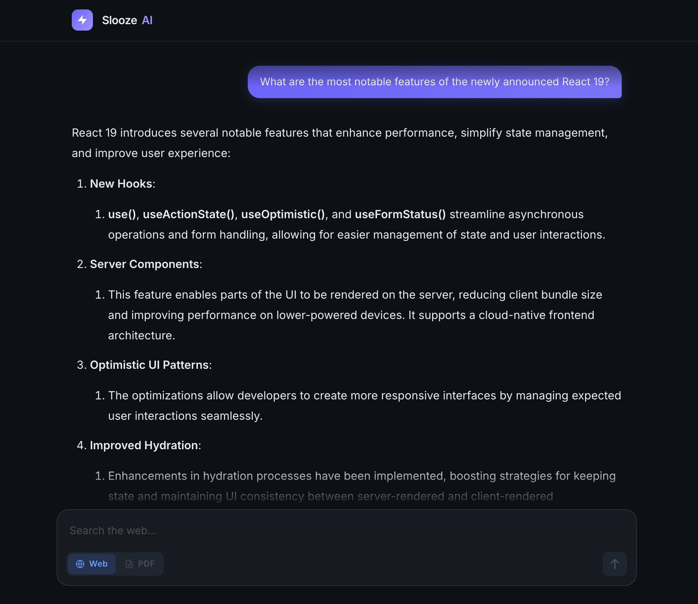
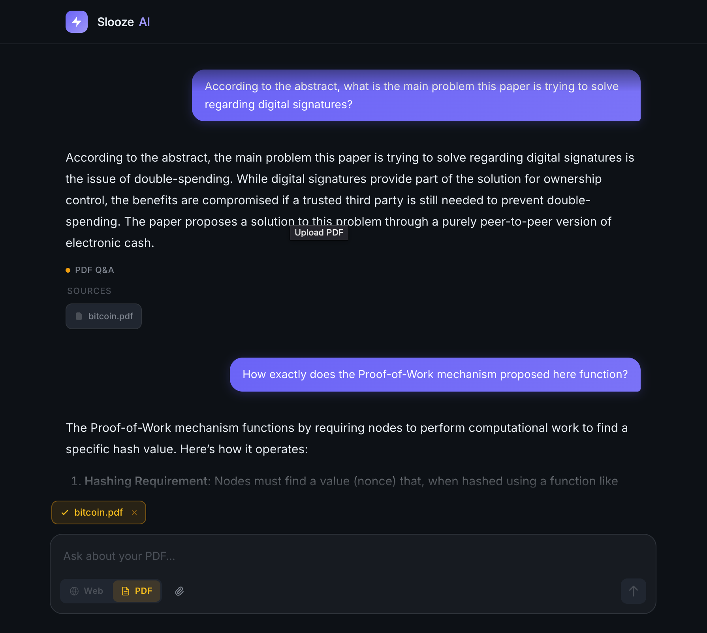

# Slooze AI Challenge

A **unified AI chat interface** that routes intelligently between live web search and PDF document Q&A — built as a take-home engineering assignment for Slooze.

Rather than delivering two isolated scripts, this solution is designed as a coherent product: one input box, two AI-powered backends, automatic routing based on the shape of the request. This mirrors the architecture of real AI assistants like Perplexity and demonstrates product thinking alongside engineering execution.

## Screenshots

<div align="center">
  
  &nbsp;
  
  <br><br>
  <em>Left: Live Web Search capability | Right: PDF Document Q&A (RAG)</em>
</div>

---

## Challenges Addressed

| | Challenge A | Challenge B |
|---|---|---|
| **Feature** | AI Web Search Agent | PDF Q&A via RAG |
| **Input** | Any natural language question | Upload a PDF, then ask questions |
| **Pipeline** | Tavily search → GPT-4o-mini | pdf-parse → chunk → embed → ChromaDB → GPT-4o-mini |
| **Output** | Streamed answer + source URLs | Streamed answer grounded in document content |
| **Follow-ups** | ✅ Context-aware across turns | ✅ Context-aware across turns |

---

## Architecture

```
┌──────────────────────────────────────────────┐
│              Next.js Frontend                │
│   Single chat UI — file upload + SSE stream  │
└──────────────────────┬───────────────────────┘
                       │ POST /api/chat
                       │ POST /api/upload
┌──────────────────────▼───────────────────────┐
│               NestJS Backend                 │
│                                              │
│   ChatController → ChatService (router)      │
│              │                  │            │
│       SearchService        RagService        │
│       (Challenge A)        (Challenge B)     │
│              │                  │            │
│              └────────┬─────────┘            │
│                   AIService                  │
│            (Vercel AI SDK + OpenAI)          │
└──────────────────────┬───────────────────────┘
                       │
           ┌───────────┴───────────┐
      Tavily API            ChromaDB Cloud
      (web search)          (vector store)
```

### Routing Logic

```
POST /api/chat
      │
      ├── documentIds present?  →  embed query → retrieve chunks → RAG response
      │
      └── plain text only?      →  [reformulate if follow-up] → Tavily → Web response
```

Routing is purely request-shape detection — no LLM needed for dispatch. Fast and deterministic.

---

## Tech Stack

**Backend** — `apps/backend/`
- NestJS 11 (TypeScript, CommonJS)
- Vercel AI SDK 6 — `streamText`, `generateText`, `embed`, `embedMany`
- OpenAI `gpt-4o-mini` (chat) + `text-embedding-3-small` (embeddings)
- Tavily API — real-time web search
- pdf-parse — PDF text extraction
- ChromaDB Cloud — hosted vector store for PDF embeddings
- Zod v4 — env validation + request validation
- `@nestjs/throttler` — 20 req/min rate limiting

**Frontend** — `apps/frontend/`
- Next.js 15 App Router + React 19
- Tailwind CSS v4 (`@theme` tokens, no config file)
- `react-markdown` + `rehype-highlight` — rendered markdown with syntax highlighting
- Custom SSE `useChat` hook — real-time streaming with conversation history

**Shared** — `packages/shared/`
- Zod schemas + inferred TypeScript types shared between backend and frontend

---

## Project Structure

```
slooze-ai-challenge/
├── apps/
│   ├── backend/                   NestJS API (port 3001)
│   │   └── src/
│   │       ├── ai/                AIService — all OpenAI calls (swap provider here)
│   │       ├── chat/              ChatController + ChatService (router)
│   │       ├── search/            TavilyService, SearchService  ← Challenge A
│   │       ├── ingest/            IngestService, VectorStoreService, UploadController
│   │       ├── rag/               RagService  ← Challenge B
│   │       └── common/            ZodValidationPipe, HttpExceptionFilter, shared types
│   └── frontend/                  Next.js app (port 3000)
│       ├── app/                   layout, page, globals.css
│       ├── components/            Header, ChatWindow, MessageBubble, ChatInput…
│       ├── hooks/                 useChat (SSE + history), usePdfLibrary
│       └── lib/                   uploadPdf API helper, shared frontend types
└── packages/
    └── shared/                    Zod schemas + TypeScript types
```

> **Note on the `agent/` directory:** The assignment specifies an `agent/` directory containing all source code. In this monorepo the agent lives in two co-located apps: `apps/backend/` (the AI server — NestJS, both challenge pipelines) and `apps/frontend/` (the chat UI). Together they implement the complete agent described in the assignment.

---

## Setup

### Prerequisites

- Node.js 18+
- pnpm 9+ (`npm install -g pnpm`)
- OpenAI API key — [platform.openai.com](https://platform.openai.com)
- Tavily API key — [tavily.com](https://tavily.com) (free tier: 1 000 searches/month)
- ChromaDB Cloud account — [trychroma.com](https://trychroma.com) (free tier, for PDF RAG)

### 1. Clone and install

```bash
git clone <repo-url>
cd slooze-ai-challenge
pnpm install
```

### 2. Configure environment

```bash
cp apps/backend/.env.example apps/backend/.env
```

Edit `apps/backend/.env` and fill in your keys:

```bash
# Required for both challenges
OPENAI_API_KEY=sk-...
TAVILY_API_KEY=tvly-...

# Required for PDF Q&A (Challenge B) — all three must be set together
# Sign up free at https://trychroma.com, then:
#   CHROMA_TENANT   → shown as "Tenant ID" on the dashboard home page
#   CHROMA_DATABASE → use "default_database" unless you created a custom one
#   CHROMA_API_KEY  → Settings → API Keys → Create key
CHROMA_TENANT=...
CHROMA_API_KEY=...
CHROMA_DATABASE=default_database
```

> **Web search only?** The app starts and fully serves Challenge A with just `OPENAI_API_KEY` and `TAVILY_API_KEY`. ChromaDB credentials are optional — PDF upload routes return 503 when they are absent.

### 3. Start both dev servers

```bash
pnpm dev
```

This builds the shared package, then starts backend and frontend concurrently:
- Backend → `http://localhost:3001/api`
- Frontend → `http://localhost:3000`

Open **http://localhost:3000** in your browser.

---

## How It Works

### Challenge A — Web Search

1. User types a question → `POST /api/chat { message, messages? }`
2. `ChatService` detects no `documentIds` → delegates to `SearchService`
3. **If conversation history is present**, GPT-4o-mini rewrites the follow-up into a standalone query before hitting Tavily (e.g. after a conversation about MacBook models, `"Which one is cheaper?"` → `"MacBook Pro M5 14-inch vs 16-inch price 2025"`)
4. `TavilyService` fetches the top 5 live search results for the (possibly reformulated) query
5. Conversation history + search results are injected into the LLM prompt
6. GPT-4o-mini streams a grounded answer; tokens arrive in real time via SSE
7. Source URLs render as clickable favicon chips once streaming completes

**Follow-up example:**
```
User:      What are the latest MacBook specs?
Assistant: The MacBook Pro M5 features...

User:      Which one is cheaper?   ← reformulated to "MacBook Pro M5 14-inch vs 16-inch price" before searching
Assistant: The 14-inch base model starts at $1,599...
```

### Challenge B — PDF Q&A (RAG)

**Ingestion:**
1. User uploads a PDF → `POST /api/upload`
   - Text extracted with `pdf-parse`
   - Split into 500-character overlapping chunks
   - All chunks embedded in one batch (`text-embedding-3-small`)
   - Stored in ChromaDB Cloud tagged with a UUID `documentId`

**Query:**
1. User asks a question → `POST /api/chat { message, documentIds, messages? }`
2. `ChatService` detects `documentIds` → delegates to `RagService`
3. The query is embedded; top-N nearest chunks retrieved via ChromaDB
   - Summarization queries (`"summarize"`, `"overview"`, etc.) retrieve up to 4× more chunks for complete document coverage
4. Conversation history (last 6 turns) + retrieved chunks are injected into the LLM prompt
5. GPT-4o-mini streams a grounded answer; only document content is cited

**Multi-document:** Select multiple uploaded PDFs — the RAG pipeline queries across all selected documents in a single vector search.

---

## API Reference

### `POST /api/chat`

Streams a Server-Sent Events response.

**Request body:**
```json
{ "message": "What is React?" }
{ "message": "Which one is cheaper?", "messages": [{"role":"user","content":"What are the MacBook M5 specs?"},{"role":"assistant","content":"The MacBook Pro M5 comes in 14-inch and 16-inch models..."}] }
{ "message": "Summarise section 3", "documentIds": ["uuid-1", "uuid-2"], "messages": [...] }
```

**SSE event stream:**
```
data: {"type":"meta","sources":["https://..."],"mode":"web"}
data: {"type":"text","chunk":"React"}
data: {"type":"text","chunk":" is a JavaScript library..."}
data: {"type":"done"}
```

### `POST /api/upload`

Accepts `multipart/form-data` with a `file` field (PDF only, max 20 MB).

**Response:**
```json
{ "documentId": "3f2504e0-...", "filename": "report.pdf" }
```

---

## Key Design Decisions

### 1. Unified chat over two separate UIs
One input box routes between both challenges based on request shape — no LLM intent detection. This is deterministic, zero-latency, and impossible to misclassify. The badge (`🌐 Web` / `📄 PDF`) on each response makes routing visible without requiring the user to think about it.

### 2. Single NestJS app, two feature modules
Both challenges share one process and one `/api/chat` endpoint. In production you'd separate them into services; for a take-home, co-location means `pnpm dev` starts everything with no orchestration overhead.

### 3. Dedicated `AIModule`
All calls to the Vercel AI SDK go through `AIService`. No other module imports `ai` or `@ai-sdk/openai` directly. To swap OpenAI for any other provider (Anthropic, Gemini, Mistral), change one file.

### 4. Query reformulation for follow-up web searches
A follow-up like `"Which one is cheaper?"` is meaningless to a search engine without knowing what the user was just discussing. Before calling Tavily, the backend makes a fast non-streaming LLM call (`generateText` with a small token budget) to rewrite the follow-up into a self-contained query using conversation history (e.g. → `"MacBook Pro M5 14-inch vs 16-inch price 2025"`). If that call fails, it falls back to the original query — errors degrade gracefully without breaking the response.

### 5. ChromaDB Cloud over local/FAISS
ChromaDB's JS client with Cloud hosting requires zero local setup — no Docker, no Python. FAISS has no official JS client and would require Python bindings. ChromaDB wins clearly for this stack.

### 6. `gpt-4o-mini` over `gpt-4o`
Sufficient for both web search summarization and document Q&A. Choosing the smaller model demonstrates cost-awareness — a real engineering concern for production AI products.

### 7. Stateless conversation history
The frontend sends the last 6 completed turns with every request. Both pipelines inject this into the LLM prompt, enabling natural follow-up questions without any server-side session state. History is bounded, so token budgets stay predictable.

### 8. Summarization topK boost
When a query contains summarization intent (`"summarize"`, `"overview"`, `"recap"`, etc.), the RAG pipeline retrieves up to 4× more chunks (capped at 20) for broader document coverage. A fixed topK of 5 would return a partial summary for anything beyond a short document.

---

## Known Limitations

| Limitation | Notes |
|---|---|
| No user authentication | Any client can query any `documentId` by UUID. Production would add auth + per-user namespace isolation in ChromaDB. |
| Stateless history | Conversation context is bounded to the last 6 turns sent by the client. There is no server-side session storage. |
| PDF source attribution | Source chips show filename only. Page numbers are not extracted; chunk index is an approximation. |
| Query reformulation latency | Follow-up web searches add one extra LLM call (~300 ms) before hitting Tavily. First questions have no overhead. |

---

## Scripts

| Command | Description |
|---|---|
| `pnpm dev` | Build shared package, then start both servers concurrently |
| `pnpm dev:backend` | Backend only (shared must already be built) |
| `pnpm dev:frontend` | Frontend only (shared must already be built) |
| `pnpm build` | Production build all packages in dependency order |
| `pnpm typecheck` | Type-check all packages |
